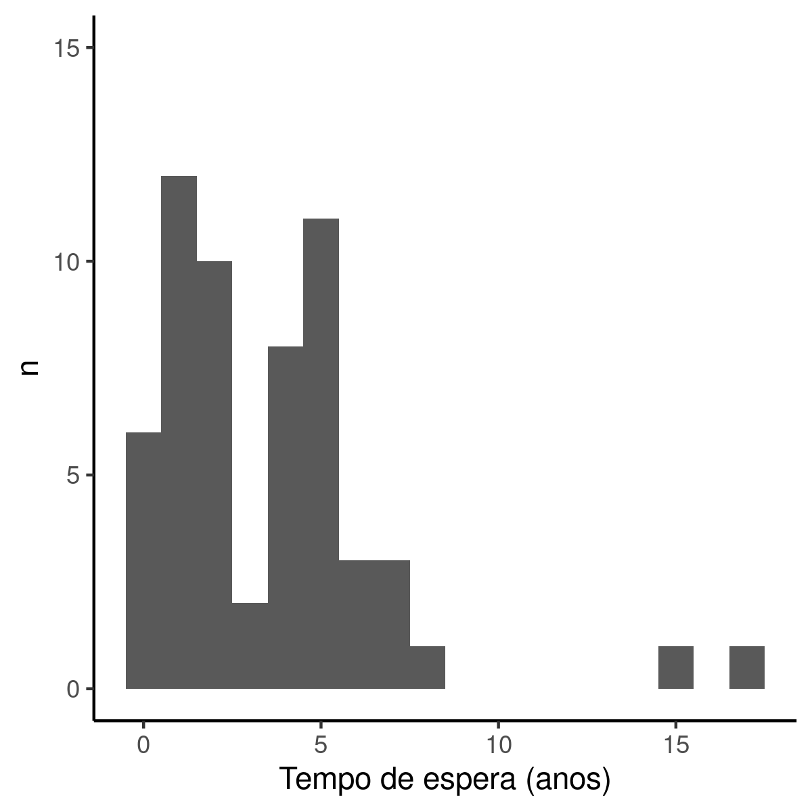

```{r setup, include=FALSE}
knitr::opts_chunk$set(echo = FALSE)
knitr::opts_knit$set(root.dir = normalizePath(".."))
options(scipen = 999)
library(pander)
library(knitr)
library(philsfmisc)
panderOptions('table.style', 'rmarkdown')
panderOptions('table.split.table', Inf)
```

---

**Histórico do documento**

```{r history}
Version <- c("01")
Changes <- c("Versão inicial")
history <- cbind(Version, Changes)
colnames(history) <- c("Versão", "Alterações")
# pander(history, split.cells = 70)
kable(history)
```

---

# Lista de abreviaturas

- AINES: anti-inflamatórios não esteroides
- ATQ: Artroplastia Total de Quadril
- HHS: Harris Hip Score
- SM: Salário Mínimo

# Introdução

## Objetivos

Descrever o perfil epidemiológico, o tempo de espera e o perfil de risco dos pacientes aguardando na fila de revisão de ATQ no estado de Santa Catarina.

## Recepção e tratamento dos dados

Os dados brutos foram recebidos em tabela Excel, que foram tratados e limpos previamente à análise.
Todas as variáveis da tabela de dados analíticos foram identificadas de acordo com as descrições das variáveis, e os valores foram identificados de acordo com o dicionário de dados providenciado.

# Metodologia

```{r results, include=FALSE}
source("scripts/results.R", encoding = 'UTF-8')
```

## Variáveis

### Desfechos primário e secundário

Esta análise descreve as características epidemiológicas e o risco em pacientes que aguardam cirgia de revisão, e nenhum endpoint foi avaliado.

### Covariáveis

As distribuições das características demográficas e clínicas foram descritas.
As variáveis consideradas para inclusão na análise foram

- Idade (anos)
- Sexo
- Escolaridade
- Tabagismo e Etilismo
- Status de aposentadoria e causa
- Renda familiar (em SM)
- Motivo da ATQ primária
- Status na deambulação na ATQ primária
- Diagnóstico atual
- Número de revisões prévias e motivo
- Uso de antidepressivos e analgésicos
- Tempo de espera (anos)
- Índice de Charlson
- Escore de Harris (HHS)
- Classificação de Paprosky

## Análises Estatísticas

As características dos pacientes foram descritas de acordo com o tipo de variávei: variáveis contínuas foram descritas como média (DP) e variáveis categóricas como frequência e proporção.
A associação entre o escore de Charlson e a classificação de Paprosky foi avaliada com o teste exato de Fisher.
Todas as análises foram realizadas ao nível de significância de 5%.
Todos os testes de hipóteses e intervalos de confiança calculados foram bicaudais.

### Softwares utilizados

Esta análise foi realizada utilizando-se o software `R` versão 4.1.0.

# Resultados

## Perfil epidemiológico dos pacientes em fila de espera de revisão de ATQ

```{r desc_indiv}
dem.idade <- inline_text(desc_dem, variable = idade_num, column = "stat_0")
dem.fund.inc <- inline_text(desc_dem, variable = escolaridade, level = "Fund. incompleto", column = "stat_0")
dem.fund.com <- inline_text(desc_dem, variable = escolaridade, level = "Fundamental", column = "stat_0")
dem.etilismo <- inline_text(desc_dem, variable = etilismo, column = "stat_0")
dem.tabagismo <- inline_text(desc_dem, variable = tabagismo, column = "stat_0")
dem.renda.ate1 <- inline_text(desc_dem, variable = renda, column = "stat_0", level = "Até 1 SM")
dem.renda.2a5 <- inline_text(desc_dem, variable = renda, column = "stat_0", level = "2 a 5 SM")
dem.trab <- inline_text(desc_dem, variable = causa, column = "stat_0", level = "Trabalhando")
dem.apos.inv <- inline_text(desc_dem, variable = causa, column = "stat_0", level = "Invalidez")
```

Foram coletadas respostas de 58 pacientes que aguardam cirurgia de revisão de ATQ (Tabela 1).
A idade média (DP) é `r dem.idade` anos.
Os níveis de escolaridade mais frequentemente observados foram relativamente baixos com
`r dem.fund.inc` pessoas possuindo Fundamental incompleto e
`r dem.fund.com` pessoas no nível Fundamental completo.
Os hábitos de vida comumente associados a comorbidades não foram prevalentes nesta amostra, onde apenas `r dem.tabagismo` são fumantes e `r dem.etilismo` fazem uso frequente de álcool.
A amostra parece ser composta predominantemente por pessoas de baixa renda, pois `r dem.renda.ate1` possuem renda de até 1 salário mínimo, seguida de `r dem.renda.2a5` pessoas recebem de 2 a 5 salários mínimos.
A maior parte dos pacientes (90%) é aposentado, sendo a Invalidez a causa apontada em `r dem.apos.inv`; apenas `r dem.trab` pessoas permaneciam em atividade laboral no momento da apresentação do questionário.

A descrição geral do perfil do paciente que aguarda cirurgia de revisão de ATQ é idosos aposentados por invalidez, com baixa escolaridade (tipicamente Fundamental incompleto) e de baixa renda (até 1 salário mínimo).
A distribuição de sexos na amostra de estudo é uniforme, e as demais características demográficas não apresenta divergências óbvias entre homens e mulheres (Tabela 1).

**Tabela 1** Características demográficas dos pacientes que aguardam revisão de ATQ.
Total da amostra e estratificação por sexo.
p = teste t ou teste exato de Fisher;
SM = salário mínimo

```{r desc_dem}
desc_dem %>% as_kable(align = "lc")
```

```{r}
cir.motivo.cox <- inline_text(desc_cir, variable = motivo_da_atq, level = "Coxartrose")
cir.motivo.frat <- inline_text(desc_cir, variable = motivo_da_atq, level = "Fraturas")
cir.deam.b <- inline_text(desc_cir, variable = deambulacao, level = "Bengala")
cir.rev.1 <- inline_text(desc_cir, variable = revisoes, level = "1")
cir.rev.2 <- inline_text(desc_cir, variable = revisoes, level = "2")
cir.motivo.rev <- inline_text(desc_cir, variable = motivo, level = "Soltura Asséptica Acetabular")
```

A tabela 2 mostra as características clínicas basais dos pacientes.
As ATQs foram realizadas para resolver principalmente coxartroses ou fraturas.
Dos 58 pacientes investigados `r cir.motivo.cox` tinham coxartrose e `r cir.motivo.frat` tinham fratura.
A deambulação foi por bengala em `r cir.deam.b` pessoas.

Mais de 80% dos pacientes atualmente na fila já realizaram pelo menos uma revisão de quadril.
`r cir.rev.2` pessoas já tendo realizado duas revisões e `r cir.rev.1` pessoas com uma única revisão.
O motivo mais prevalente das revisões prévias foi a Soltura Asséptica Acetabular que ocorreu em `r cir.motivo.rev` pacientes (Tabela 2).

A descrição geral das características clínicas basais do paciente que aguarda cirurgia de revisão de ATQ é de pacientes que
já realizaram pelo menos uma revisão por Soltura Asséptica Acetabular da ATQ,
que originalmente foi realizada por coxartrose ou fratura.
Sua deambulação frequentemente foi feita com uso de bengala ou livre.

**Tabela 2** Características clínicas basais, relativas à ATQ.
Dados relativos a eventos anteriores à indicação da revisão em espera.

```{r desc_cir}
desc_cir %>% as_kable(align = "lc")
```

## Tempo de espera de revisão de ATQ

```{r moda_1, include=FALSE}
dados %>%
  filter(tempo_anos == 2) %>%
  select(tempo_anos, idade_num, sexo, diagnostico_atual, charlson, charlson_faixa, hhs, paprosky) %>%
  kable()
```
```{r moda_2, include=FALSE}
dados %>%
  filter(tempo_anos == 6) %>%
  select(tempo_anos, idade_num, sexo, diagnostico_atual, charlson, charlson_faixa, hhs, paprosky) %>%
  kable()
```

```{r t maior que 10, include=FALSE}
dados %>%
  filter(tempo_anos > 10) %>%
  select(tempo_anos, idade_num, sexo, diagnostico_atual, charlson, charlson_faixa, hhs, paprosky) %>%
  kable()
```

```{r t menor que 1, include=FALSE}
dados %>%
  filter(tempo_anos == 0) %>%
  select(tempo_anos, idade_num, sexo, diagnostico_atual, charlson, charlson_faixa, hhs, paprosky)

```

O tempo de espera médio é de 3.5 anos (Tabela 3).
A distribuição de tempo de espera é bimodal (Fig 1), onde identifica-se dois grandes grupos de pacientes aguardando há 2 anos e 6 anos respectivamente.
Há 10 pacientes que aguardam há 2 ou 3 anos, cujas idades entre 45 e 80 anos e nos quais o diagnóstico mais comum é Soltura Asséptica Acetabular (n = 6) seguido de Soltura Asséptica de Ambos (n = 3).
Seus índices de Charlson são tipicamente baixos, HHS em torno de 44% e as classificações Paprosky mais frequentes são 2C e 3A.
Os pacientes que aguardam há 5 ou 6 anos (n = 14) tem perfil semelhante, com idades entre 44 a 83 anos e diagnóstico típico Soltura Asséptica Acetabular.
A maiorira possui índice de Charlson baixo (n = 7), mas 3 pacientes possuem Charlson entre 0% e 5%, e 4 pacientes possuem Charlson entre 5% e 10%.
A classificação de Paprosky típica foi 2C (n=6) seguida das classificações 2A e 3A (n = 3, cada).

```{r Fig1, fig.cap="**Figura 1** Distribuição do tempo de espera para cirurgia de revisão"}
# 
knitr::include_graphics("../figures/dist_tempo.png", error = FALSE)
```

Seis pacientes aguardam na fila há menos de 1 ano completo, com tempo de espera entre 6 e 10 meses.
Estes são em sua maioria homens, com idades entre 48 e 69 anos.
O diagnóstico atual mais prevalente é Soltura Asséptica Acetabular, índice de Charlson baixo, HHS em torno de 40% e classificações de Paprosky 1, 2B e 2C.

No extremo superior se observou dois pacientes aguardando a revisão há mais de 10 anos -- um homem de 84 anos aguarda há 15 anos e uma mulher de 50 anos aguarda há 17 anos.
Os dados clínicos do primeiro não foram obtidos e o diagnóstico atual da segunda é Soltura Asséptica Acetabular e ela possui o índice de Charlson 3.4%, HHS 10% e classificação Paprosky 2C.

## Características clínicas dos pacientes durante a espera

```{r charlson_sens, include=FALSE}
dados %>% transmute(charlson, charlson0 = na_if(charlson, 0)) %>% summarize(mean(charlson, na.rm = TRUE), mean(charlson0, na.rm = TRUE))
clin.charl.0 <- inline_text(desc_clin, variable = charlson_faixa, level = "0%")
clin.pap.2c <- inline_text(desc_clin, variable = paprosky, level = "2C")
clin.pap.3a <- inline_text(desc_clin, variable = paprosky, level = "3A")
```

As características clinicas dos pacientes avaliados no questionário são apresentadas na Tabela 3.
O diagnóstico atual mais prevalente é a Soltura Asséptica Acetabular, seguida da Soltura Asséptica de Ambos.
O escore de Charlson médio na amostra é 3%, onde `r clin.charl.0` pessoas possuem escore de 0%.
Considerando apenas as pessoas que possuem risco positivo de morrer no próximo ano o escore médio é 6%.
Os escores de Harris (HHS) observados variaram de 10.6 a 80, com valor médio 41.
A classificação de Paprosky mais prevalente é 2C com `r clin.pap.2c` pessoas, seguida de 3A com `r clin.pap.3a` pessoas.
Os pacientes atualmente na fila de espera fazem uso de diversos tipos de analgésicos, sendo AINES a classe individual de analésico mais usada.
A maior parte dos pacientes investigados (34%) usam uma combinação de classes de analgésicos.
Uma pequena parte da amostra (14%) faz uso de antidepressivos.

A descrição geral das características clínicas relativas à espera é que o paciente típico está aguardando a revisão de quadril há 3.5 anos por um diagnóstico de Soltura Asséptica Acetabular.
O paciente típico possui escore médio de Charlson 3%, escore médio de HHS 41 e classificação Paprosky 2C.
Usa ainda combinações de analgésicos e quando emprega uma única classe a AINES é mais favorecida.

**Tabela 3** Características clínicas relativas à espera da cirurgia de revisão.
AINES: anti-inflamatórios não esteroides.

```{r desc_clin}
desc_clin %>% as_kable(align = "lc")
```

As duas medidas de risco aos pacientes utilizadas neste estudo foram correlacionadas para investigar se há associação entre suas distribuções de frequências.
O índice de Charlson, quando convertido para porcentagem, confere uma quantificação do risco de morte no próximo ano.
Na amostra, as três classificações de Paprosky mais prevalentes foram 2B, 2C e 3A (Tabela 4).
As ocorrências dessas três categorias parecem estar uniformemente distribuídas em relação às faixas consideradas para o escore de Charlson, sem associação detectável (p = 0.5).
Não podemos, nesta amostra, afirmar que determinadas classificações de Paprosky estão associadas ao aumento do risco de morte no próximo ano conforme mensuradas pelo escore de Charlson.

**Tabela 4** Associação entre as classificações de risco: escore de Charlson e as 3 classificações de Paprosky mais frequentes na amostra.
p = teste exato de Fisher.

```{r inf_charlson_pap3}
inf_charlson_pap3 %>% as_kable(align = "c")
```


# Exceções e Observações

# Conclusões

O perfil do paciente que aguarda cirurgia de revisão de ATQ é composto primariamente por
idosos aposentados por invalidez,
com baixa escolaridade
e de baixa renda.
Ambos os sexos foram igualmente representados na amostra, tanto na avaliação global quanto comparando com as outras características demográficas.

O paciente típico na fila de espera já realizou uma ou mais revisões da ATQ
que originalmente foi realizada por coxartrose ou fratura.
A causa mais frequentemente identificada para revisões foi a Soltura Asséptica Acetabular da ATQ, e
sua deambulação foi feita com uso de bengala ou livre.

O tempo de espera médio de três anos e meio.
A distribuição do tempo de espera é bimodal, com valores extremos.
Distinguem-se dois grupos de pacientes que aguardam a cirurgia há aprox. 2 anos e 6 anos.
Dois pacientes aguardam há mais de 10 anos.

O diagnóstico atual mais prevalente Soltura Asséptica Acetabular.
O paciente típico possui escore médio de Charlson 3%, escore médio de HHS 41 e classificação Paprosky 2C.
Usa combinações de analgésicos e quando emprega uma única classe a AINES é mais favorecida.

# Referências

- **SAP-2021-003-FP-v01** -- Plano Analítico para Perfil epidemiológico de pacientes aguardando na fila de revisão de ATQ em Santa Catarina
<!-- - Cohen, J. (1988). Statistical power analysis for the behavioral sciences (2nd Ed.). New York: Routledge. -->

# Apêndice

## Análise exploratória de dados

```{r A1, fig.cap="**Figura 1** Distribuição da idade na população do estudo."}
# 
# knitr::include_graphics("../figures/dist_tempo.png", error = FALSE)
```

## Disponibilidade

Este documento pode ser obtido no seguinte endereço:

https://github.com/philsf-biostat/SAR-2021-003-FP/

## Dados utilizados

Os dados utilizados neste relatório não podem ser publicados online por questões de sigilo.

```{r data}
# print analytical of analytical_mockup whether it is the private or public version of the SAR

# analytical %>%
#   pander(caption = "**Table A1** Tabela de dados analíticos")
analytical_mockup %>%
  pander(caption = "**Table A1** Estrutura da tabela de dados analíticos")
```

