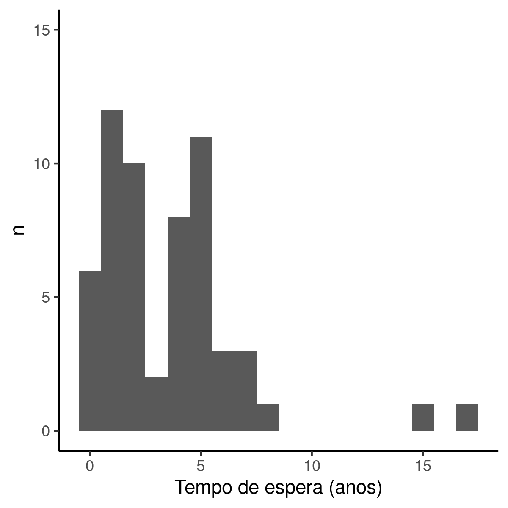

---

**Histórico do documento**


|Versão |Alterações     |
|:------|:--------------|
|01     |Versão inicial |

---

<!-- # Assinaturas -->

<!-- ```{r, echo=FALSE} -->
<!-- sig.field <- "__________________________" -->
<!-- date.field <- "_____________" -->
<!-- Stat <- c("Elaborador", "Nome", "Função", sig.field, date.field) -->
<!-- Reviewer <- c("Revisado por", "", "", sig.field, date.field) -->
<!-- Approver <- c("Verificado por", "", "", sig.field, date.field) -->
<!-- Final.Approver <- c("Aprovação final", "", "", sig.field, date.field) -->

<!-- sigs <- rbind( -->
<!--   Stat -->
<!--   , Reviewer -->
<!--   , Approver -->
<!--   , Final.Approver -->
<!--   ) -->
<!-- rownames(sigs) <- NULL -->
<!-- colnames(sigs) <- c("Papel", "Nome", "Função", "Assinatura", "Data") -->

<!-- # pander(sigs, split.cells = c(9, 14, 14, 16, 8), split.table = Inf) -->
<!-- kable(sigs) -->
<!-- ``` -->

# Lista de abreviaturas

# Introdução

## Objetivos

## Recepção e tratamento dos dados

# Metodologia


## Variáveis

### Desfechos primário e secundário

### Covariáveis

## Análises Estatísticas

### Softwares utilizados

Esta análise foi realizada utilizando-se o software `R` versão 4.1.0.

# Resultados

## Perfil epidemiológico dos pacientes em fila de espera de revisão de ATQ


Foram coletadas respostas de 58 pacientes que aguardam cirurgia de revisão de ATQ (Tabela 1).
A idade média (DP) é 63 (11) anos.
Os níveis de escolaridade mais frequentemente observados foram relativamente baixos com
45 (78%) pessoas possuindo Fundamental incompleto e
11 (19%) pessoas no nível Fundamental completo.
Os hábitos de vida comumente associados a comorbidades não foram prevalentes nesta amostra, onde apenas 9 (16%) são fumantes e 2 (3.4%) fazem uso frequente de álcool.
A amostra parece ser composta predominantemente por pessoas de baixa renda, pois 46 (79%) possuem renda de até 1 salário mínimo, seguida de 10 (17%) pessoas recebem de 2 a 5 salários mínimos.
A maior parte dos pacientes (90%) é aposentado, sendo a Invalidez a causa apontada em 41 (71%); apenas 6 (10%) pessoas permaneciam em atividade laboral no momento da apresentação do questionário.

A descrição geral do perfil do paciente que aguarda cirurgia de revisão de ATQ é idosos aposentados por invalidez, com baixa escolaridade (tipicamente Fundamental incompleto) e de baixa renda (até 1 salário mínimo).
A distribuição de sexos na amostra de estudo é uniforme, e as demais características demográficas não apresenta divergências óbvias entre homens e mulheres (Tabela 1).

**Tabela 1** Características demográficas dos pacientes que aguardam revisão de ATQ.
Total da amostra e estratificação por sexo.
p = teste t ou teste exato de Fisher;
SM = salário mínimo


|**Características dos pacientes** | **Total**, N = 58 |**M**, N = 31 | **F**, N = 27 |**valor p** |
|:---------------------------------|:-----------------:|:-------------|:-------------:|:-----------|
|__Idade__                         |      63 (11)      |64 (11)       |    62 (11)    |0.7         |
|__Escolaridade__                  |                   |              |               |0.4         |
|Fund. incompleto                  |     45 (78%)      |26 (84%)      |   19 (70%)    |            |
|Fundamental                       |     11 (19%)      |5 (16%)       |    6 (22%)    |            |
|Médio                             |     1 (1.7%)      |0 (0%)        |   1 (3.7%)    |            |
|Superior                          |     1 (1.7%)      |0 (0%)        |   1 (3.7%)    |            |
|Não alfabetizado                  |      0 (0%)       |0 (0%)        |    0 (0%)     |            |
|Méd. incompleto                   |      0 (0%)       |0 (0%)        |    0 (0%)     |            |
|Sup. incompleto                   |      0 (0%)       |0 (0%)        |    0 (0%)     |            |
|__Tabagismo__                     |      9 (16%)      |6 (19%)       |    3 (11%)    |0.5         |
|__Etilismo__                      |     2 (3.4%)      |1 (3.2%)      |   1 (3.7%)    |>0.9        |
|__Aposentadoria__                 |                   |              |               |0.3         |
|Invalidez                         |     41 (71%)      |25 (81%)      |   16 (59%)    |            |
|Tempo De Serviço                  |     10 (17%)      |4 (13%)       |    6 (22%)    |            |
|Trabalhando                       |      6 (10%)      |2 (6.5%)      |    4 (15%)    |            |
|Pensionista                       |     1 (1.7%)      |0 (0%)        |   1 (3.7%)    |            |
|__Renda familiar__                |                   |              |               |0.3         |
|Até 1 SM                          |     46 (79%)      |27 (87%)      |   19 (70%)    |            |
|2 a 5 SM                          |     10 (17%)      |3 (9.7%)      |    7 (26%)    |            |
|Mais que 5 SM                     |     2 (3.4%)      |1 (3.2%)      |   1 (3.7%)    |            |


A tabela 2 mostra as características clínicas basais dos pacientes.
As ATQs foram realizadas para resolver principalmente coxartroses ou fraturas.
Dos 58 pacientes investigados 29 (50%) tinham coxartrose e 19 (33%) tinham fratura.
A deambulação foi por bengala em 40 (69%) pessoas.

Mais de 80% dos pacientes atualmente na fila já realizaram pelo menos uma revisão de quadril.
22 (56%) pessoas já tendo realizado duas revisões e 13 (33%) pessoas com uma única revisão.
O motivo mais prevalente das revisões prévias foi a Soltura Asséptica Acetabular que ocorreu em 23 (66%) pacientes (Tabela 2).

A descrição geral das características clínicas basais do paciente que aguarda cirurgia de revisão de ATQ é de pacientes que
já realizaram pelo menos uma revisão por Soltura Asséptica Acetabular da ATQ,
que originalmente foi realizada por coxartrose ou fratura.
Sua deambulação frequentemente foi feita com uso de bengala ou livre.

**Tabela 2** Características clínicas basais, relativas à ATQ.
Dados relativos a eventos anteriores à indicação da revisão em espera.


|**Características dos pacientes**         | **N = 58** |
|:-----------------------------------------|:----------:|
|__Motivo da ATQ__                         |            |
|Coxartrose                                |  29 (50%)  |
|Fraturas                                  |  19 (33%)  |
|Outros                                    |  7 (12%)   |
|Displasia                                 |  2 (3.4%)  |
|Osteonecrose                              |  1 (1.7%)  |
|__Deambulação__                           |            |
|Bengala                                   |  40 (69%)  |
|Livre                                     |  7 (12%)   |
|Andador                                   |  6 (10%)   |
|Cadeira de rodas                          |  5 (8.6%)  |
|Leito                                     |   0 (0%)   |
|__Revisões prévias de quadril__           |            |
|0                                         |  4 (10%)   |
|1                                         |  13 (33%)  |
|2                                         |  22 (56%)  |
|Desconhecido                              |     19     |
|__Motivo de revisões prévias__            |            |
|Soltura Asséptica Acetabular              |  23 (66%)  |
|Soltura Asséptica de Ambos                |  7 (20%)   |
|Infecção                                  |  2 (5.7%)  |
|Soltura Asséptica Femoral                 |  2 (5.7%)  |
|Fratura Periprotética                     |  1 (2.9%)  |
|Desconhecido                              |     23     |
|__Ciurgia (não ortop.) durante a espera__ |  3 (5.2%)  |

## Tempo de espera de revisão de ATQ


A distribuição de tempo de espera é bimodal (Fig 1), onde identifica-se dois grandes grupos de pacientes aguardando há 2 anos e 6 anos respectivamente.
Há 10 pacientes que aguardam há 2 ou 3 anos, cujas idades entre 45 e 80 anos e nos quais o diagnóstico mais comum é Soltura Asséptica Acetabular (n = 6) seguido de Soltura Asséptica de Ambos (n = 3).
Seus índices de Charlson são tipicamente baixos, HHS em torno de 44% e as classificações Paprosky mais frequentes são 2C e 3A.
Os pacientes que aguardam há 5 ou 6 anos (n = 14) tem perfil semelhante, com idades entre 44 a 83 anos e diagnóstico típico Soltura Asséptica Acetabular.
A maiorira possui índice de Charlson baixo (n = 7), mas 3 pacientes possuem Charlson entre 0% e 5%, e 4 pacientes possuem Charlson entre 5% e 10%.
A classificação de Paprosky típica foi 2C (n=6) seguida das classificações 2A e 3A (n = 3, cada).



**Figura 1** Distribuição do tempo de espera para cirurgia de revisão

Seis pacientes aguardam na fila há menos de 1 ano completo, com tempo de espera entre 6 e 10 meses.
Estes são em sua maioria homens, com idades entre 48 e 69 anos.
O diagnóstico atual mais prevalente é Soltura Asséptica Acetabular, índice de Charlson baixo, HHS em torno de 40% e classificações de Paprosky 1, 2B e 2C.

No extremo superior se observou dois pacientes aguardando a revisão há mais de 10 anos -- um homem de 84 anos aguarda há 15 anos e uma mulher de 50 anos aguarda há 17 anos.
Os dados clínicos do primeiro não foram obtidos e o diagnóstico atual da segunda é Soltura Asséptica Acetabular e ela possui o índice de Charlson 3.4%, HHS 10% e classificação Paprosky 2C.

## Características clínicas dos pacientes durante a espera

**Tabela 3** Características clínicas relativas à espera da cirurgia de revisão.
AINES: anti-inflamatórios não esteroides.


|**Características dos pacientes** | **N = 58**  |
|:---------------------------------|:-----------:|
|__Tempo de espera (anos)__        | 3.52 (3.21) |
|__Diagnóstico atual__             |             |
|Soltura Asséptica Acetabular      |  34 (72%)   |
|Soltura Asséptica de Ambos        |  10 (21%)   |
|Fratura Periprotética             |  1 (2.1%)   |
|Infecção                          |  1 (2.1%)   |
|Soltura Asséptica Femoral         |  1 (2.1%)   |
|Desconhecido                      |     11      |
|__Escore de Charlson__            |             |
|0%                                |  29 (51%)   |
|0% a 5%                           |  14 (25%)   |
|5% a 10%                          |   8 (14%)   |
|Maior que 10%                     |   6 (11%)   |
|Desconhecido                      |      1      |
|__HHS__                           |   41 (15)   |
|Desconhecido                      |      1      |
|__Classificação Paprosky__        |             |
|2C                                |  19 (35%)   |
|3A                                |  11 (20%)   |
|2B                                |   8 (15%)   |
|1                                 |   7 (13%)   |
|2A                                |   7 (13%)   |
|3B                                |  2 (3.7%)   |
|3C                                |   0 (0%)    |
|Desconhecido                      |      4      |
|__Uso de antidepressivos__        |   8 (14%)   |
|__Número de medicações em uso__   |             |
|0                                 |  16 (28%)   |
|1                                 |  19 (33%)   |
|2                                 |  20 (34%)   |
|3                                 |  3 (5.2%)   |
|__Uso de analgésicos__            |             |
|Vários                            |  20 (34%)   |
|AINES                             |  18 (31%)   |
|Nenhum                            |   9 (16%)   |
|Opióides                          |   9 (16%)   |
|Analgésicos                       |  2 (3.4%)   |

# Exceções e Observações

# Conclusões

O perfil do paciente que aguarda cirurgia de revisão de ATQ é composto primariamente por
idosos aposentados por invalidez,
com baixa escolaridade
e de baixa renda.
Ambos os sexos foram igualmente representados na amostra, tanto na avaliação global quanto comparando com as outras características demográficas.

O paciente típico na fila de espera já realizou uma ou mais revisões da ATQ
que originalmente foi realizada por coxartrose ou fratura.
A causa mais frequentemente identificada para revisões foi a Soltura Asséptica Acetabular da ATQ, e
sua deambulação foi feita com uso de bengala ou livre.

A distribuição do tempo de espera é bimodal, com valores extremos.
Distinguem-se dois grupos de pacientes que aguardam a cirurgia há aprox. 2 anos e 6 anos.
Dois pacientes aguardam há mais de 10 anos.

# Referências

# Apêndice

## Análise exploratória de dados

## Dados utilizados

Os dados utilizados neste relatório não podem ser publicados online por questões de sigilo.


